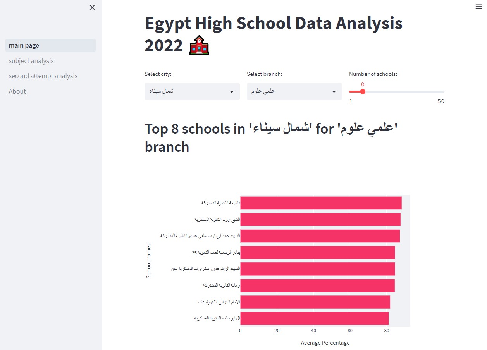

# High School Data Analysis Streamlit App

## Description

Highly interactive web based Data Analysis app for high school education in Egypt 2022



## Demo App

[](https://mightystud-high-school-data-analysis-streamlit-main-page-wqneeb.streamlit.app/)

## Instructions

1. Install

    [Streamlit docs](https://docs.streamlit.io/library/get-started/installation)

    ```bash
    pip install streamlit pandas plotly
    ```

2. Run

    ```bash
    streamlit run main_page.py
    ```

## About The Dataset

The third year in secondary school or as it is called in arabic [Thanaweya Amma(ثانوية عامة)](https://en.wikipedia.org/wiki/Thanaweya_Amma), which is series of standardized tests in Egypt that lead to the General Secondary Education Certificate for public secondary schools and serves as the entrance examination for Egyptian public universities. The data results were scraped in a collaborative fashion and anonymize from different website that hosts the data publicly.

The dataset and the collection procedures is available on [kaggle datasets](https://www.kaggle.com/datasets/mohamedahmedx2/high-school-public-results-2022-eg).

## Motivation

This code was written for educational purposes as a part of [Omdena challenge](https://omdena.com/chapter-challenges/high-school-thanaweya-amma-data-analysis/).

## Auther

[M. A. Ali](https://www.linkedin.com/in/mohamedahmedx2/)

## license

Licensed under the MIT License Copyright (c) 2022 M. A. Ali
